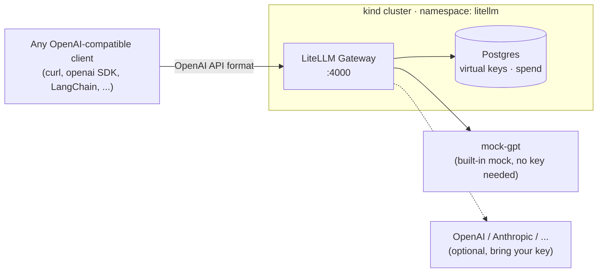

# LiteLLM on kind

Run the [LiteLLM AI Gateway](https://docs.litellm.ai/docs/simple_proxy) on a local [kind](https://kind.sigs.k8s.io/) (Kubernetes-in-Docker) cluster. You don't need a cloud account or an LLM API key: the install ships with a mock model, so you can verify the whole stack end to end and only add real provider keys when you actually want them.

This guide exists because a plain `helm install` of the official LiteLLM chart fails out of the box right now (August 2026). The chart's bundled Postgres points at Docker Hub tags that [Bitnami deleted in 2025](https://github.com/bitnami/containers/issues/83267), and one of those images is hardcoded in the chart templates where no Helm value can reach it. The workarounds are small, but you have to know they exist. With them, the whole install takes about ten minutes.

## What is LiteLLM, and which part are we deploying?

LiteLLM is one project used two ways. As an SDK, it's a Python library (`pip install litellm`) that gives your own code a single interface to 100+ LLM providers; there is nothing to deploy. As a server, called the Proxy or the AI Gateway depending on which docs page you're reading, it exposes an OpenAI-compatible API in front of every provider and adds virtual API keys, spend tracking, budgets, rate limits, model routing with fallbacks, guardrails, and an admin UI.

This guide deploys the server.



## Prerequisites

| Tool | Verify with | Install |
|---|---|---|
| Docker | `docker version` | [docs](https://docs.docker.com/get-docker/) |
| kind | `kind version` | [docs](https://kind.sigs.k8s.io/docs/user/quick-start/#installation) |
| kubectl | `kubectl version --client` | [docs](https://kubernetes.io/docs/tasks/tools/) |
| Helm 3.8+ | `helm version` | [docs](https://helm.sh/docs/intro/install/) |
| Node.js 18+ (only for the JavaScript examples) | `node --version` | [docs](https://nodejs.org) |

Last tested: August 2026, on Linux, with chart `litellm-helm 0.1.100` and LiteLLM `v1.96.2` on Kubernetes v1.35.

## Quickstart

Deploy LiteLLM in one shot using curl, no clone needed:
```bash
curl -fsSL https://raw.githubusercontent.com/AlisterBaroi/litellm-kind-deployment/main/scripts/setup.sh | bash
```

> To install into a kind cluster you already have, pass its name:
> ```bash
> export KIND_CLUSTER_NAME=<my-kind-cluster> #  <-- set kind cluster here
> echo $KIND_CLUSTER_NAME
> ```
> ```bash
> curl -fsSL https://raw.githubusercontent.com/AlisterBaroi/litellm-kind-deployment/main/scripts/setup.sh | CLUSTER_NAME=$KIND_CLUSTER_NAME bash
> ```

The script runs the same steps described below: it creates a kind cluster named `litellm` (or reuses `CLUSTER_NAME`), applies the Postgres image workaround, and installs the newest stable LiteLLM release. It finishes by printing your master key and the port-forward command that opens the web UI. It's non-interactive, safe to re-run, and exits non-zero on failure, which makes it a one-stop local install and a drop-in step for CI/CD pipelines, for example standing up a gateway inside a kind-based integration test job.

Piping a stranger's script into bash deserves a healthy pause, so [read it first](scripts/setup.sh), or clone and run it locally:

```bash
git clone https://github.com/AlisterBaroi/litellm-kind-deployment.git
cd litellm-kind-deployment
./scripts/setup.sh
```

## Manual Setup

The rest of this README does the same thing by hand, with explanations.

### Step 1: Pick a cluster name and create the cluster

Later commands refer to the cluster by name, so set it once as an environment variable:

```bash
export CLUSTER_NAME=litellm   # or the name of a kind cluster you already have

kind create cluster --name "$CLUSTER_NAME"
```

> Already have a kind cluster? Set `CLUSTER_NAME` to its name, skip the `kind create cluster` line, and make sure kubectl points at it: `kubectl config use-context "kind-$CLUSTER_NAME"`. Everything installs into its own `litellm` namespace, so it coexists fine with other workloads.

### Step 2: Pre-load the Postgres init image

The chart's Deployment includes an init container that waits for Postgres before the gateway starts. Its image, `docker.io/bitnami/postgresql:16.1.0-debian-11-r20`, no longer exists: Bitnami moved all versioned tags to the read-only `bitnamilegacy` namespace in 2025. The reference is hardcoded in the chart template, so no Helm value can fix it. What you can do is pull the legacy image inside the kind node and re-tag it under the name the chart expects. The node's pull policy is `IfNotPresent`, so the pre-loaded copy gets used instead of a registry pull that would fail.

```bash
for node in $(kind get nodes --name "$CLUSTER_NAME"); do
  docker exec "$node" crictl pull docker.io/bitnamilegacy/postgresql:16.1.0-debian-11-r20
  docker exec "$node" ctr --namespace=k8s.io images tag --force \
    docker.io/bitnamilegacy/postgresql:16.1.0-debian-11-r20 \
    docker.io/bitnami/postgresql:16.1.0-debian-11-r20
done
```

> Why not `docker pull` plus `kind load docker-image`? On newer Docker installs (the containerd image store) that fails with `ctr: content digest ... not found`. Pulling directly on the node avoids the whole problem.

The main Postgres image has the same Bitnami problem, but that one is overridable. The [values.yaml](values.yaml) in this repo already redirects it to `bitnamilegacy/postgresql`.

### Step 3: Install the chart

Two things get decided at install time: which LiteLLM version to run, and what the master key is.

The chart defaults the image tag to `latest`, so resolve the newest stable release yourself. GitHub marks LiteLLM's release candidates as pre-releases, which keeps them out of `releases/latest`:

```bash
export LITELLM_VERSION=$(curl -s https://api.github.com/repos/BerriAI/litellm/releases/latest \
  | sed -n 's/.*"tag_name": *"\([^"]*\)".*/\1/p')
echo "$LITELLM_VERSION"
```

If you want a specific version instead, set `LITELLM_VERSION` by hand; anything on the [releases page](https://github.com/BerriAI/litellm/releases) works.

The install also needs this repo's [values.yaml](values.yaml). If you didn't clone, download it into your working directory:

```bash
curl -fsSLO https://raw.githubusercontent.com/AlisterBaroi/litellm-kind-deployment/main/values.yaml
```

The master key is the gateway's root credential and must start with `sk-`. Generate one, then install:

```bash
export LITELLM_MASTER_KEY="sk-$(openssl rand -hex 16)"
export LITELLM_DB_PASSWORD="$(openssl rand -hex 16)"

helm install litellm oci://ghcr.io/berriai/litellm-helm --version 0.1.100 \
  --namespace litellm --create-namespace \
  -f values.yaml \
  --set image.tag="$LITELLM_VERSION" \
  --set masterkey="$LITELLM_MASTER_KEY" \
  --set postgresql.auth.password="$LITELLM_DB_PASSWORD" \
  --set postgresql.auth."postgres-password"="$LITELLM_DB_PASSWORD"
```

The values file handles the rest. It defines `mock-gpt`, a model that answers with a canned `mock_response` instead of calling any provider, and it redirects the bundled Postgres image to `bitnamilegacy` (see step 2).

> After installing, Helm prints the chart's own NOTES block, which suggests a port-forward to `http://127.0.0.1:8080`. That's generic chart boilerplate, not where anything is deployed; this guide forwards the gateway's real port instead (step 4, port 4000).

You may notice the LiteLLM version floats to the newest release while the chart stays pinned at `--version 0.1.100`. That's deliberate. The app version only decides which LiteLLM binary runs, so newer is fine. The chart version decides the Kubernetes manifests themselves, and step 2's workaround targets an image tag hardcoded inside this exact chart's templates; a newer chart could change or fix that, so the pin only moves after someone re-tests the workarounds against it.

Setting `masterkey` yourself matters more than it looks. If you leave it out, the chart generates a random key, and then generates a fresh one on every `helm upgrade`, which silently breaks every client you've pointed at the gateway.

Wait for the pods. The first run pulls a gigabyte or so of images, so give it a few minutes:

```bash
kubectl wait --for=condition=ready pod \
  -l app.kubernetes.io/name=litellm -n litellm --timeout=600s
kubectl get pods -n litellm
```
> Expected output:
> ```text
> NAME                       READY   STATUS    RESTARTS   AGE
> litellm-5578755f87-zvdxj   1/1     Running   0          2m10s
> litellm-postgresql-0       1/1     Running   0          2m10s
> ```

### Step 4: Talk to your gateway

Port-forward the service and leave it running in a separate terminal:

```bash
kubectl port-forward -n litellm svc/litellm 4000:4000
```

Your master key lives in a Secret. Read it back any time:

```bash
export LITELLM_MASTER_KEY=$(kubectl get secret litellm-masterkey -n litellm \
  -o jsonpath='{.data.masterkey}' | base64 -d)
```

Check that the gateway is up:

```bash
curl http://localhost:4000/health/liveliness
# "I'm alive!"
```

Then send a chat completion through it. No provider key is involved:

```bash
curl -s http://localhost:4000/v1/chat/completions \
  -H "Authorization: Bearer $LITELLM_MASTER_KEY" \
  -H "Content-Type: application/json" \
  -d '{"model": "mock-gpt", "messages": [{"role": "user", "content": "Are you alive?"}]}'
```

```json
{
  "model": "mock-gpt",
  "object": "chat.completion",
  "choices": [{
    "message": {
      "content": "Hello from LiteLLM on kind! This is a mock response - no API key was used.",
      "role": "assistant"
    }
  }]
}
```

Since the API is OpenAI-compatible, any OpenAI SDK works as-is:

```python
from openai import OpenAI

client = OpenAI(base_url="http://localhost:4000/v1", api_key="<your-master-key>")
resp = client.chat.completions.create(
    model="mock-gpt", messages=[{"role": "user", "content": "Hello!"}]
)
print(resp.choices[0].message.content)
```

To run the same call using the standard JavaScript OpenAI SDK, first install the package:

```bash
npm install openai
```

```javascript
import OpenAI from "openai";

const openai = new OpenAI({
  baseURL: "http://localhost:4000/v1",
  apiKey: "<your-master-key>",
});

const completion = await openai.chat.completions.create({
  model: "mock-gpt",
  messages: [{ role: "user", content: "Hello!" }],
});

console.log(completion.choices[0].message.content);
```

The same call, using the LangChain JavaScript integration client:

```bash
npm install @langchain/openai @langchain/core
```

```javascript
import { ChatOpenAI } from "@langchain/openai";

const model = new ChatOpenAI({
  configuration: {
    baseURL: "http://localhost:4000/v1",
  },
  apiKey: "<your-master-key>",
  model: "mock-gpt",
});

const response = await model.invoke("Hello!");
console.log(response.content);
```

### Step 5: Admin UI and virtual keys

With the port-forward running, open http://localhost:4000/ui and log in with username `admin` and your master key as the password.

Don't expect to see the master key anywhere inside the UI. The Virtual Keys page lists keys stored in the gateway's database, and the master key isn't one of them: it lives in the `litellm-masterkey` Kubernetes Secret and is read back with the kubectl command from step 4. The list also starts empty on a fresh install, and LiteLLM shows any key's full value exactly once, at creation.

Virtual keys are the reason to run a gateway at all: API keys you mint per user, team, or app, each with its own model allowlist, budget, and rate limits, with spend recorded in Postgres. Create one in the UI, or via the API:

```bash
curl -s http://localhost:4000/key/generate \
  -H "Authorization: Bearer $LITELLM_MASTER_KEY" \
  -H "Content-Type: application/json" \
  -d '{"models": ["mock-gpt"], "key_alias": "my-first-key"}'
```

The response contains a new `sk-...` key that can call `mock-gpt` and nothing else. Use it in the `Authorization` header exactly like the master key.

### Step 6: Add a real provider

When you're ready to route to a real LLM:

1. Put your provider key(s) in a Secret:

   ```bash
   kubectl create secret generic litellm-provider-keys -n litellm \
     --from-literal=OPENAI_API_KEY="sk-your-real-key"
   ```

2. In [values.yaml](values.yaml), uncomment the `gpt-4o-mini` block (or the Anthropic one) and the `environmentSecrets` section. The config references the Secret's keys as `os.environ/OPENAI_API_KEY`.

3. Upgrade the release. `--reuse-values` keeps your master key, DB password, and image version:

   ```bash
   helm upgrade litellm oci://ghcr.io/berriai/litellm-helm --version 0.1.100 \
     --namespace litellm --reuse-values -f values.yaml
   ```

Then call it exactly like the mock model, just with `"model": "gpt-4o-mini"`.

## Cleanup

Helm uninstall + delete namespace (keeps cluster), using curl:

```bash
curl -fsSL https://raw.githubusercontent.com/AlisterBaroi/litellm-kind-deployment/main/scripts/cleanup.sh | bash

# or tear down the whole kind cluster (add CLUSTER_NAME=<name> if it isn't "litellm")
# curl -fsSL https://raw.githubusercontent.com/AlisterBaroi/litellm-kind-deployment/main/scripts/cleanup.sh | DELETE_CLUSTER=true bash
```

> If running from a locally cloned repo:
> ```bash
> # delete deployment and namespace (keep cluster)
> ./scripts/cleanup.sh 
> 
> # or tear down the whole kind cluster (add CLUSTER_NAME=<name> if it isn't "litellm")
> # DELETE_CLUSTER=true ./scripts/cleanup.sh
> ```

The cleanup script respects the same `CLUSTER_NAME` variable as setup. If you don't set it, the script searches your kind clusters for the one that has the LiteLLM release and cleans that one; it stops and asks for `CLUSTER_NAME` if several match. The exception is `DELETE_CLUSTER=true`, which never guesses: it only deletes the cluster you name (default `litellm`). Or do it by hand: `helm uninstall litellm -n litellm && kubectl delete namespace litellm` (deleting the namespace also removes the Postgres PVC), and `kind delete cluster --name "$CLUSTER_NAME"` if you created a cluster just for this.

## Troubleshooting

| Symptom | Cause and fix |
|---|---|
| `litellm-postgresql-0` in `ImagePullBackOff` | The install ran without this repo's [values.yaml](values.yaml), so the chart asked for a Bitnami tag that no longer exists on Docker Hub. Upgrade with `-f values.yaml`. |
| LiteLLM pod stuck at `Init:0/1` with `ImagePullBackOff` | Step 2 was skipped, so the hardcoded init image isn't on the node. Run step 2, then delete the pod so it retries. |
| Gateway pod can't pull `ghcr.io/berriai/litellm-database:<version>` | Images for a brand-new release can lag the GitHub release. Set `LITELLM_VERSION` to the previous release and re-run the install. |
| `helm install oci://...` fails with `403 ... denied` | Stale ghcr.io credentials on your machine. Run `helm registry logout ghcr.io` and/or `docker logout ghcr.io`, then retry. |
| `kind load docker-image` fails with `content digest ... not found` | A known kind issue with Docker's containerd image store. Use the node-side `crictl pull` and `ctr tag` from step 2 instead. |
| Requests return `401` after a `helm upgrade` | The upgrade ran without `--reuse-values` or `--set masterkey=...`, so the chart generated a fresh master key. Read the new one back from the Secret (step 4). |
| Postgres `CrashLoopBackOff` after uninstall and reinstall | The old PVC kept the previous password. Run `kubectl delete pvc -n litellm data-litellm-postgresql-0` and reinstall. |
| UI rejects your login | The username is `admin` and the password is the master key itself. |

## Contributing

Found a rough edge, or did an upstream change break a step? That report is the most useful contribution this repo can get, and [CONTRIBUTING.md](CONTRIBUTING.md) explains what to include. The [issue tracker](https://github.com/AlisterBaroi/litellm-kind-deployment/issues) has a labeled backlog, including several marked `good first issue`.

If this guide saved you an afternoon, a star helps other people find it.

## License

[MIT](LICENSE)
